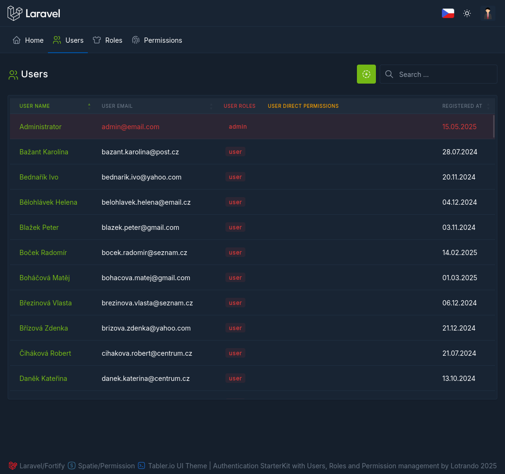
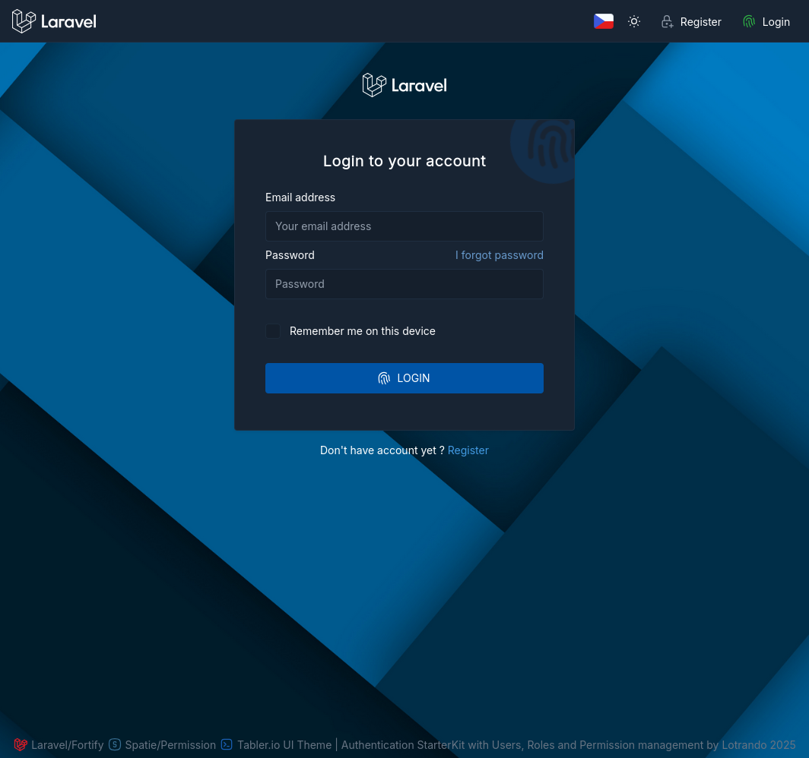
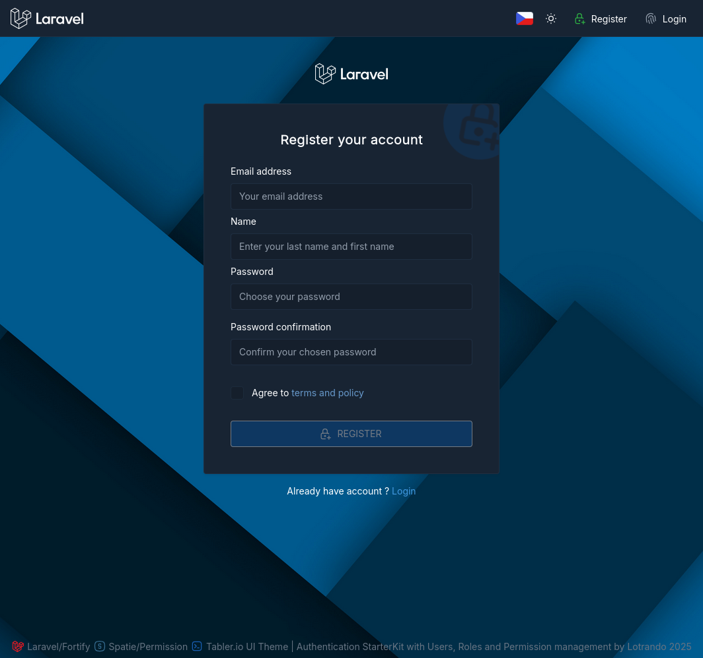
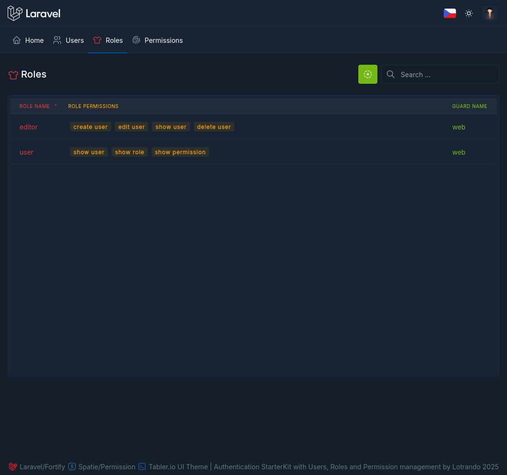
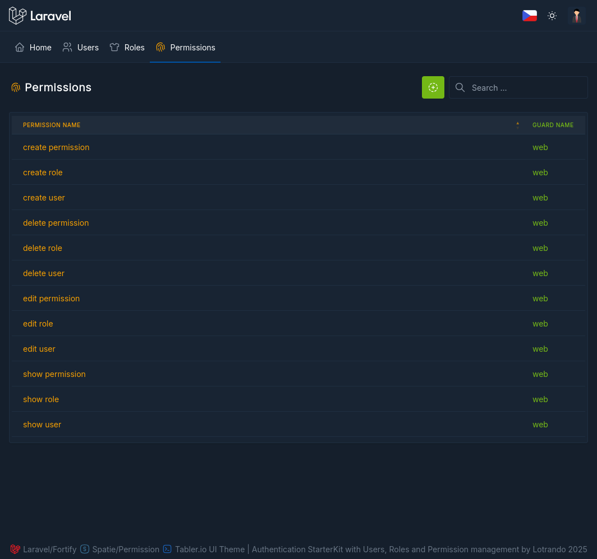
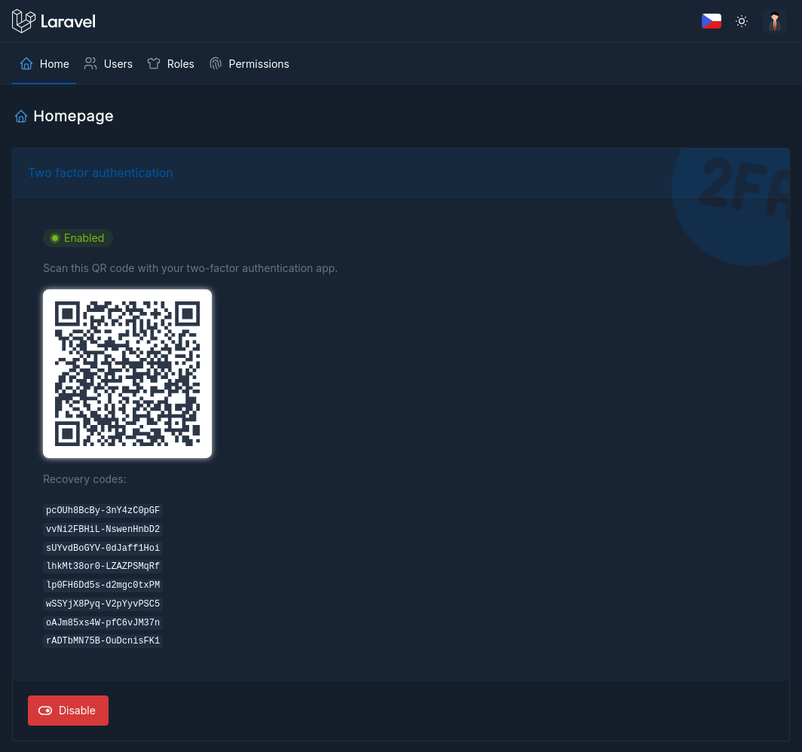
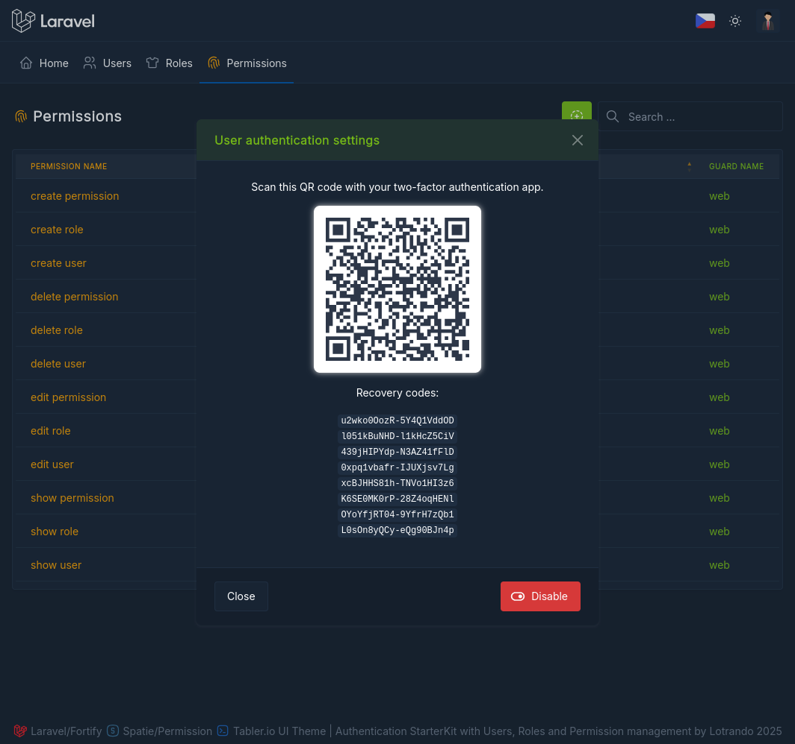

## Screenshot
<p align="center">
    
</p>

## Instalation
```
git clone https://github.com/lotrando/laravel-roles-permissions
```

```
cd laravel-roles-permissions
```

```
cp .env.example .env
```

```
nano .env
```

## Setup database for Laravel
```
DB_CONNECTION=mysql
DB_HOST=127.0.0.1
DB_PORT=3306
DB_DATABASE=laravel-roles-permissions
DB_USERNAME={user}
DB_PASSWORD={password}
```

## Install dependecies
```
composer install
```

## Artisan commands
```
php artisan key:generate
php artisan migrate --seed
php artisan serve
```

## Other screens
<p align="center">
    
</p>
<p align="center">
    
</p>
<p align="center">
    
</p>
<p align="center">
    
</p>
<p align="center">
    
</p>
<p align="center">
    
</p>


